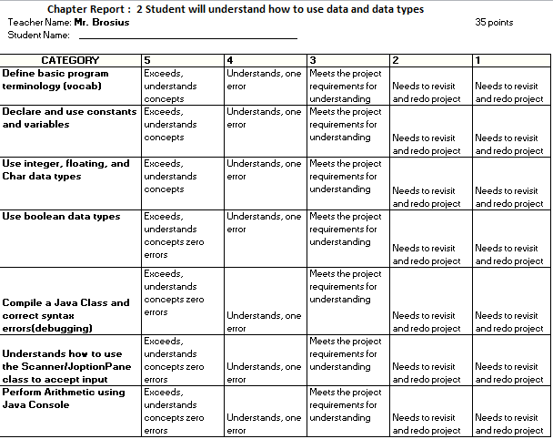

<h1>Chapter 2</h2>
<h3>Student will understand how to use data and data types</h3>

Using Data
Assignments answer each of these in your Google Site
Page 58 figure 2-1 using Concatenated "+" and page 60
You Do It  page 62
What are Integer Data Types page 64
What is the Boolean Data Types page 70 
What is the Char Data type page 73
Page 83 do figure 2-21 in Eclipse
Page 84 complete You Do It
Page 88 Complete figure 2-26 in Eclipse
Page 90 Complete figure 2-30 in Eclipse
Page 91 complete figure 2-32 in Eclipse
Page 97 complete figure 2-37 in Eclipse
Page 98 You Do It
Page 104 You Do it

<h3>This all goes into your Chapter 2 Portfolio</h3> 
What is the Scanner Class?
What are Floating Data points? How did they use this information for the Superman 3 movie?
What is the JOptionPane Class? How does it work?, What is the library input?
Programming Exercises 4-8  page 115
Game Zone Page 117 Number 1 and 2 
Mad Libs
Random Guess Match (#9 on page 115)

